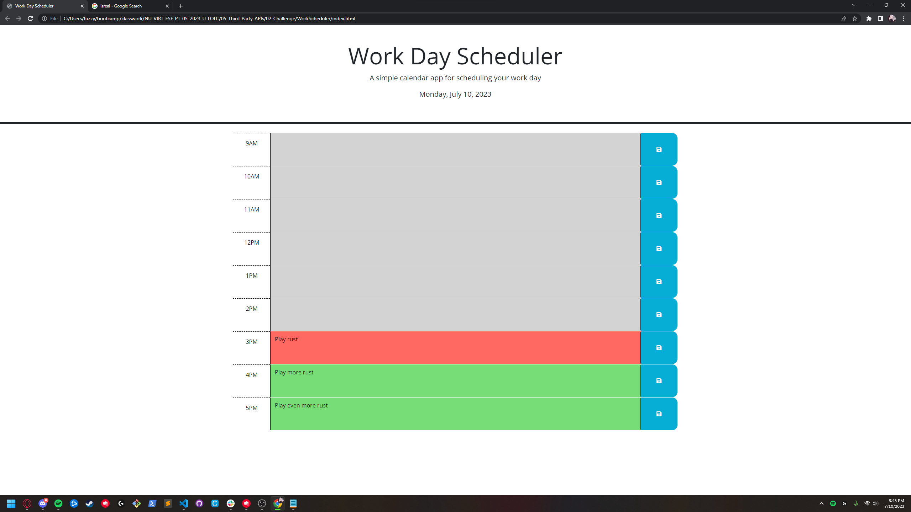

# WorkScheduler
Welcome to the WorkScheduler repository! This repository contains an open-source project aimed at providing a flexible and efficient solution for scheduling and managing work tasks. Whether you're an individual looking to organize your personal workload or a team working collaboratively, WorkScheduler offers a powerful set of features to streamline your work management process.

## Installation

To install you can either clone the repo and open the webpage VIA the index.HTML or visit https://loganrehberg.github.io/WorkScheduler/

## Screenshot of the Deployed Website

